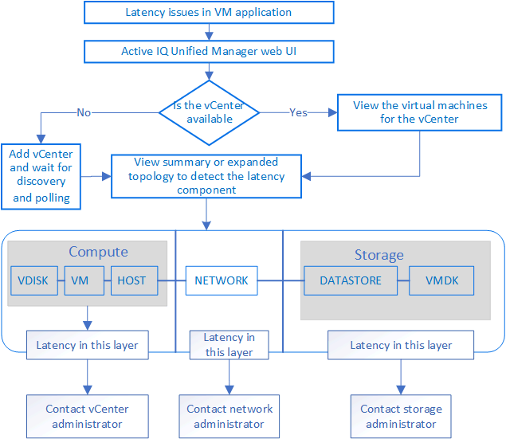

= VMware 仮想インフラを監視する
:allow-uri-read: 
:icons: font
:imagesdir: ../media/

[role="lead"]
Active IQ Unified Manager では、データストアに導入された仮想マシン（VM）を可視化し、仮想環境内のストレージやパフォーマンスの問題を監視してトラブルシューティングできます。この機能を使用すると、ストレージ環境におけるレイテンシの問題や、vCenterでパフォーマンスイベントが報告されたタイミングを特定できます。

ONTAP の一般的な仮想インフラ環境には、さまざまなコンポーネントがコンピューティングレイヤ、ネットワークレイヤ、ストレージレイヤに分散して配置されています。VM アプリケーションのパフォーマンス低下は、各レイヤのさまざまなコンポーネントでレイテンシが生じていることが原因である可能性があります。この機能は、ストレージまたはvCenterの管理者およびITゼネラリストが、仮想環境でパフォーマンス問題 を分析したり、問題 が発生したコンポーネントを特定したりするのに役立ちます。

Unified Manager のトポロジビューには、仮想環境の基盤となるサブシステムが表示され、コンピューティングノード、ネットワーク、またはストレージでレイテンシ問題が発生したかどうかが確認されます。また、修復手順を実行して基盤となる問題に対応するために、パフォーマンス低下の原因となっているオブジェクトが強調表示されます。

ONTAP ストレージ上の仮想インフラには、次のオブジェクトが含まれます。

* データストア：データストアは、VMのホストに接続される仮想ストレージオブジェクトです。LUN やボリュームなどの ONTAP の管理可能なストレージエンティティであり、ログファイル、スクリプト、構成ファイル、仮想ディスクなどの VM ファイルのリポジトリとして使用され、SAN または IP ネットワーク接続を介して環境内のホストに接続されます。vCenterにマッピングされているONTAP 外部のデータストアは、Unified Managerではサポートされず、表示もされません。
* ホスト： VMware の仮想化ソフトウェアである ESXi を実行し、 VM をホストする物理システムまたは仮想システムです。
* vCenter：仮想環境のVMware VM、ESXiホスト、およびすべての関連コンポーネントを管理する一元化されたコントロールプレーンです。vCenterの詳細については、VMwareのドキュメントを参照してください。
* 仮想ディスク：ホスト上の仮想ディスクで、拡張子はVMDKです。仮想ディスクのデータは対応する VMDK に格納されます。
* VM ： VMware 仮想マシン。
* VMDK ：仮想ディスク用のストレージスペースを提供するデータストア上の仮想マシンディスクです。仮想ディスクごとに対応する VMDK があります。

これらのオブジェクトは VM トポロジビューに表示されます。

* ONTAP での VMware 仮想化 * image:../media/vm-deployment.gif[""]

* ユーザーワークフロー *

次の図は、 VM トポロジビューを使用する一般的なユースケースを示しています。

== 対応していない機能

* vCenterインスタンスにマッピングされているONTAP 外部のデータストアは、Unified Managerではサポートされません。これらのデータストアに仮想ディスクがある VM もサポートされません。
* データストアとしてサポートされるのはNASボリュームとSANボリュームだけです。仮想ボリューム（vVol）はサポートされません。
* これらのビューでは、さまざまなコンポーネントのパフォーマンスを分析するためのレポートを生成することはできません

