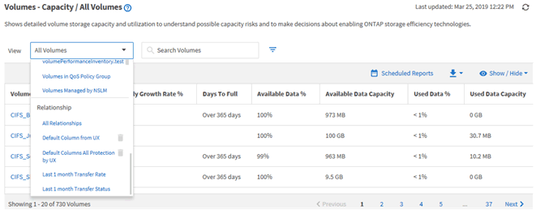

= ビューとレポートの関係を理解している必要があります
:allow-uri-read: 
:icons: font
:imagesdir: ../media/

[role="lead"]
ビューとインベントリページは、ダウンロードまたはスケジュール設定したレポートになります。

ビューとインベントリページはカスタマイズして保存し、再利用することができます。Unified Managerで表示できるほぼすべての情報を、レポートとして保存、再利用、スケジュール設定、共有できます。

ビューのドロップダウンでは、削除アイコンが表示されている項目は、自分または他のユーザーが作成した既存のカスタムビューです。アイコンのない項目は、 Unified Manager のデフォルトビューです。デフォルトビューは変更または削除できません。

[NOTE]
====
リストからカスタムビューを削除すると、そのビューを使用するスケジュール済みレポートもすべて削除されます。カスタムビューを変更した場合、そのビューを使用するレポートに変更が反映されるのは、レポートスケジュールに従って次回レポートが生成されてEメールで送信されるときです。

====

削除アイコンが表示され、ビューやスケジュール済みレポートを変更したり削除したりできるのは、アプリケーション管理者ロールまたはストレージ管理者ロールのユーザだけです。
